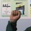
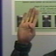
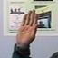
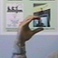
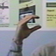
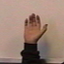
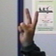

# Guesture Recognition

This is a Torch implementation for guesture recognition based on CNN. There are six kinds of guestures, including `A`, `B`, `C`, `Five`, `Point`, `V`. Some guestures images are shown below:

## Setup:

Dependencies:
* [torch7](https://github.com/torch/torch7)
* Linux

